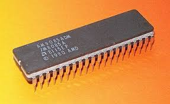

# 8085 Assembly Binary Search Implementation

This project demonstrates a **binary search algorithm** written in **8085 Assembly**.  

The code initializes memory with values from `0` to `7`, then searches for a specified value using binary search.

## 📌 Features
- Memory initialization with 8 elements.
- Binary search algorithm implementation.
- Efficient comparison and jump logic.

## 💻 Code Overview
The binary search follows these steps:
1. Initialize memory with values.
2. Set `low` and `high` pointers.
3. Compute the middle index.
4. Compare the target (`needle`) with the middle element.
5. Adjust search bounds accordingly.
6. Store the result at memory address `9`.

## 🛠️ How to Run
To run this code in an **8085 emulator**:
1. Load the program into an 8085 simulator.
2. Execute the program step-by-step.
3. Observe how the binary search works.

## 📜 License
This project is licensed under the MIT License.
